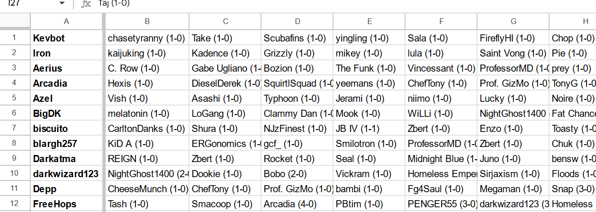

# norcal-ssbm-power-ranker-pgstats.com

This gets all melee sets from the good-players.csv file from pgstats.com within the ranking period.  
If a tournment is missing from [pgstats](https://pgstats.com), we won't get any data.  
It also filters to only in person tounrnaments.

It outputs a wins.csv and a losses.cs

```sh
# make venv first
python -m venv venv
source venv/bin/activate
python -m pip install -r requirements.txt

# run main.py
python src/main.py

# upload csvs to google sheets
```

If a tournament is missing from pgstats, you can request it to be added here: [data form](https://docs.google.com/forms/d/e/1FAIpQLScKXIoIBxnh0NmYtxto5_kkkuJybI9-Ipss2e-RdX4Bx2GHkg/viewform?usp=sf_link) . This is taken from the footer of their website.

## Other Notes

This is a quick and dirty script. Could be improved in a number of ways (see github issues)

## Todo:

- [ ] rewrite combined player ids when adding sets to the database
- [ ] use sqlite for everything
- [ ] move models to their own file (?)
- [ ] display sqlite data in streamlit as a table
- [ ] trim down player model by removing results data (keep the profile data, though (maybe rename to metadata))
- [ ] run data analysis on the data as sqlite
- [ ] deploy something to dokku
